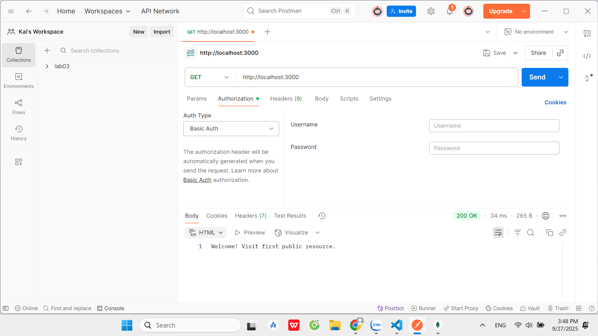
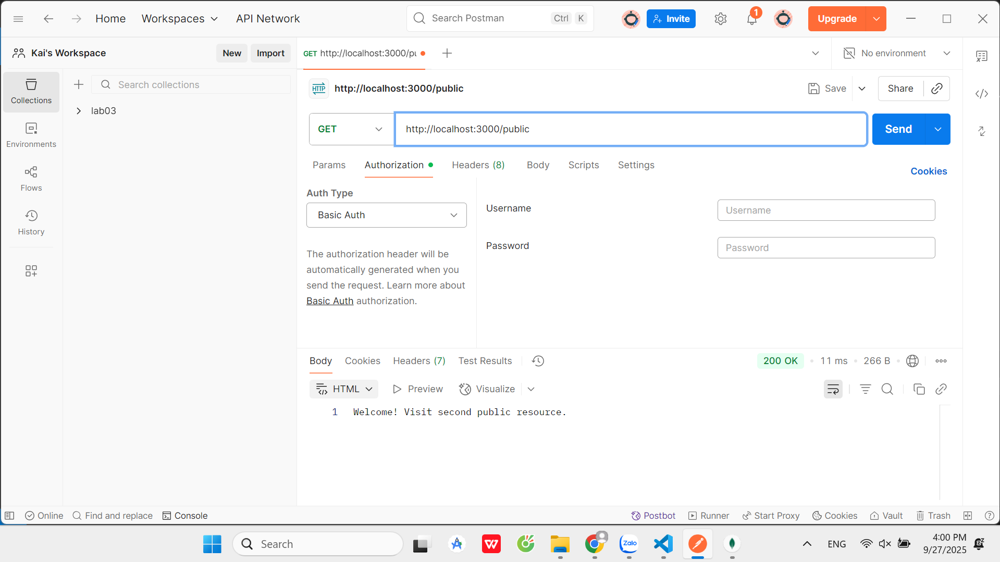
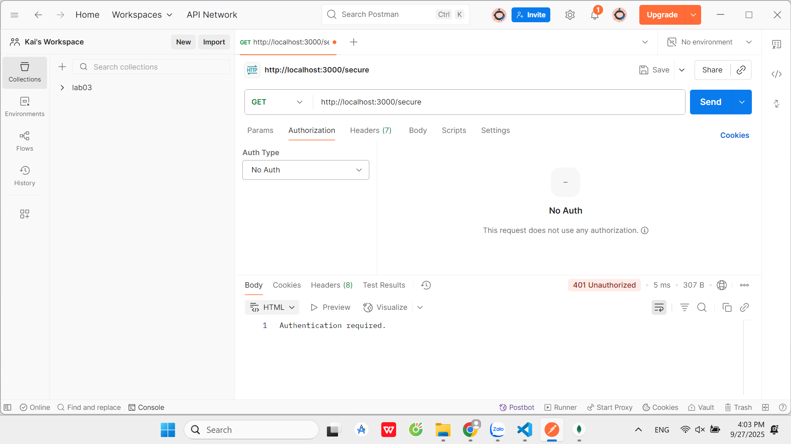
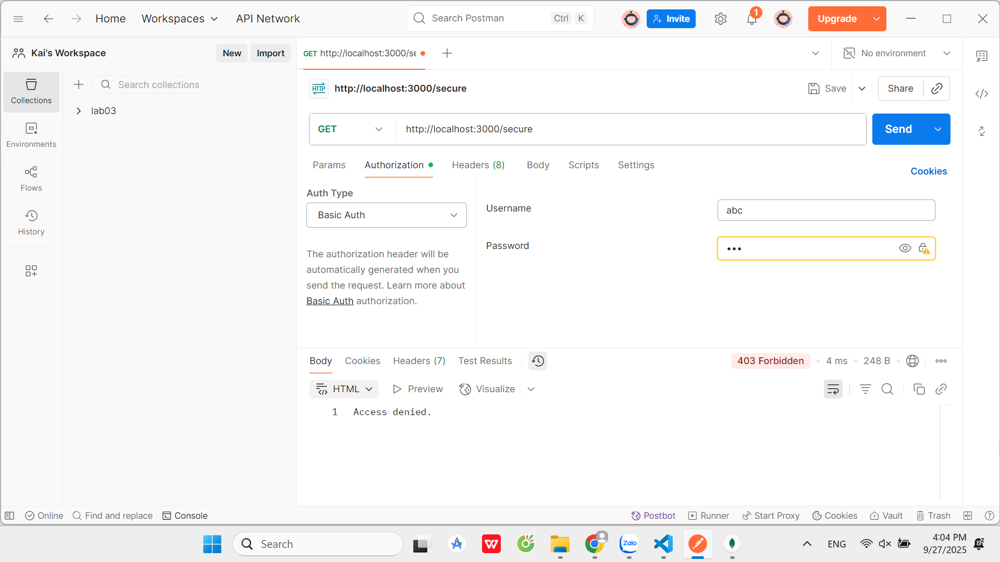
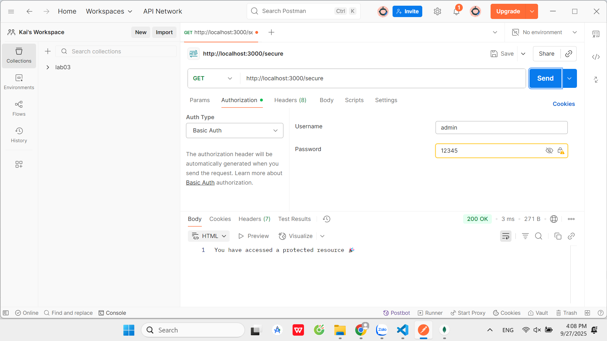
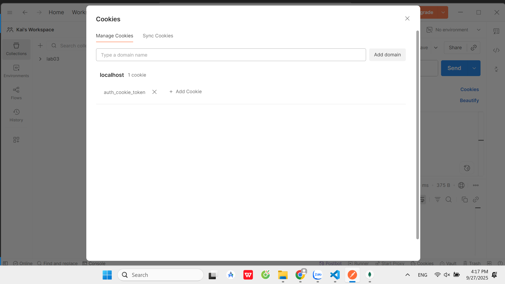
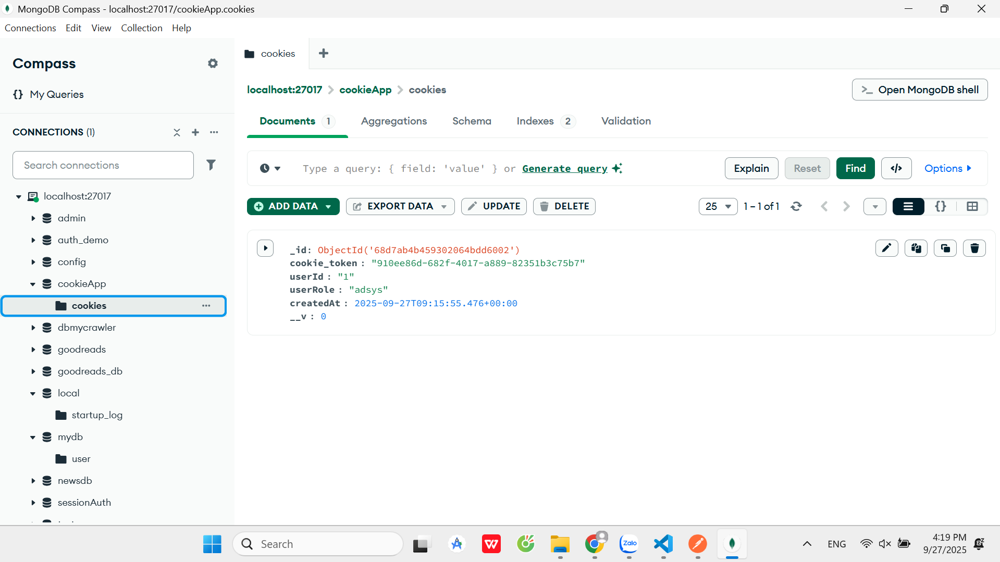
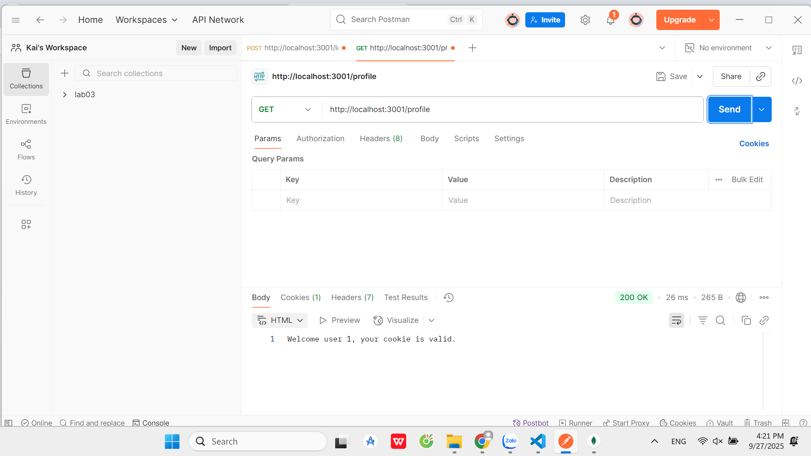
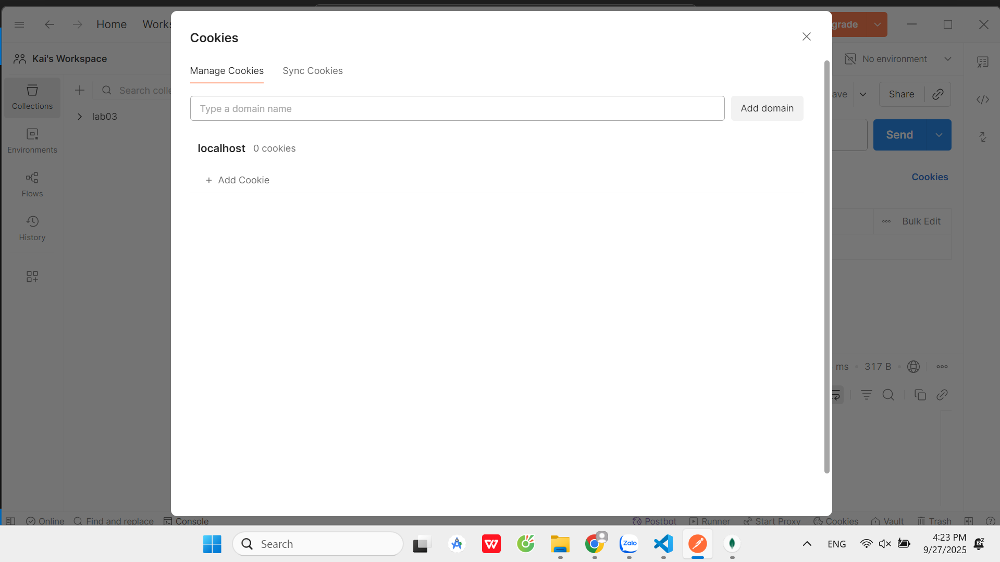
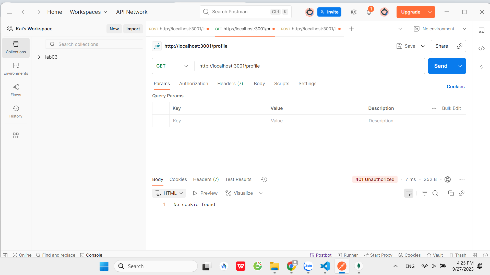

# simple_auth
*Test Basic Auth
1. Gửi request:  
GET http://localhost:3000/  

2. Gửi request:  
GET http://localhost:3000/public  

3. Gửi request:  
GET http://localhost:3000/secure  

4. Trong Postman → tab Authorization  
- Chọn Basic Auth  
- Username: abc  
- Password: 123  
- Gửi request GET http://localhost:3000/secure  

5. Trong Postman → tab Authorization  
- Chọn Basic Auth  
- Username: admin  
- Password: 12345  
- Gửi request GET http://localhost:3000/secure  

*Test cookie_auth
1. Tạo request:
POST http://localhost:3001/login
Tab Body → chọn raw, JSON → nhập:
{
  "username": "admin",
  "password": "12345"
}

2. Kiểm tra cookie trong MongoDB

3. Gửi request:
GET http://localhost:3001/profile

4. Gửi request:
POST http://localhost:3001/logout

5. Truy cập profile sau khi logout
GET http://localhost:3001/profile
